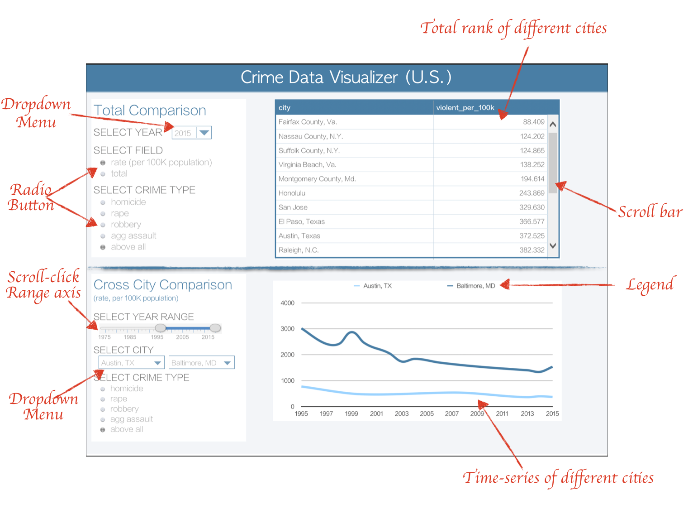

# Project Milestone 1: Proposal

## Section 1: Overview

Crime is a problem in major cities where it causes negative emotional and physical effects and requires costly solutions for public tax payers. Legislation is needed for criminal law enforcement, prevention, regulation and decriminalization. This app will help identify violent crime trends by filtering cities and in respect to population of that city in a year in interest.

The app provides the user visualization to explore trends on which specific type of crime is increasing or decreasing in which city and provides insights that can identify where to increase police patrols in certain cities. It also explores of how crime rates change in respect to city population.

## Section 2: Description of the data

Data consists of 2831 records from different cities for different types of crimes. Each sample has 14 variables; year the data was collected (Year), from which city (City) and population of the city (Total_pop), total number of homicides, rapes, robberies, aggressive violence (homs_sum, rape_sum,	rob_sum,	agg_ass_sum,	violent_crime), month of the year (month) as well as the number of violent crimes per 100,000 people (violent_per_100k, homs_per_100k, rape_per_100k, rob_per_100k, agg_ass_per_100k).  

## Section 3: Usage scenario & tasks
Zoe is an analyst from the Ministry of Finance and she was assigned to review the budget of the policy patrol cars for 2018. She is curious if the increase of visible police patrols led to less crime. She wants to be able to [explore] a dataset in order to [compare] the crime rates over time across major cities in the United States, and [identify] the cities with larger decrease in crime rates over the last ten years. She would then like to reference the data with police patrols. When Zoe logs on to the "Crime Data Visualizer app", she will see an overview of the dataset to navigate from, such as the timeline, a list of the cities, and a list of major types of crimes. After selecting the year 2015 and viewing the crime rate, she saw the entire ranking of the major cities in United States. Then she randomly selected one city with lower crime rate and one city with a higher crime rate, Austin(TX) and Baltimore (MD). From the bottom half of the app, Zoe may choose to view the data over the past 20 years (1995 to 2015) for the two cities she selected. The chart showed her that the crime rate in Austin has been relatively steady for the past 20 years, while Baltimore did have a visible decrease from 1999 to 2005. From the information she got from the app, Zoe cross reference, to see if Baltimore had increased its police patrols during the specific time period.

## Section 4: Description of app & sketch

The landing page of the app will have two sections.

The first section would provide the entire ranking of all cities given specific variables. Users can select a specific year (1975 to 2015) from the drop-down list, then select if they want to view the data for the crime rate or total amount of crimes. If a specific type of crime is preferred, then the users can click the assigned radio button, otherwise, the default setting is counting all types of violent crimes. Users can compare the crime data of different cities by scrolling down the table on the right side of this section. The cities would be ranked from least crimes/crime rates to the most.

The second section allows the user to do a cross-city comparison, with selectable time range. The dragging range axis allows the user to select a time frame. Then there are two dropdown menus for city selection (if only one city is selected, the chart would show data for one city). Again, if the data for any one type of violent crime is interesting, users can make the choice using the radio buttons. The chart on the right would show the time series plots for the selected cities crime rates.

**Example sketch**

The example sketch shows the visual design of the app.

