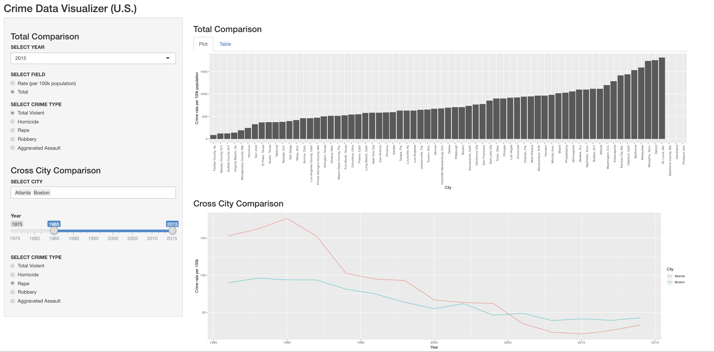
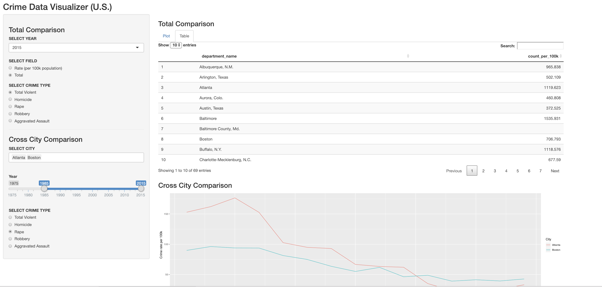

# Project Milestone 2: Writeup

## Rationale

We want out users to get a big idea of the crime situation across the whole country of United States, while they are also able to compare across specific cities.

For the total comparison across all the major cities in United States，we include both the bar plot and the data table in two different tabs, allowing users to see the ranked data on the plot and search for the table for any specific number if interested. For this section, we provide selections on:
- "year"
- "type of crime"
- "field or metric" (can select either "crime rate per 100k population" or "amount of crime for total population")

For the comparison across specific selected cities, we only used the data of "crime rate per 100k population", as that would be a reasonable variable to compare on across different cities regardless of the population size. In this section, to answer the question, "if crime rate of a city has been increasing/decreasing during a certain time?", we used a line plot to show the trend of changing over time. Users can select a range of years, as many cities as they prefer, and on any type of crime of interest.

## Tasks

- Data cleaning (wrote a script to clean and export data to be used in the app)
- Building control panel for both comparisons (which don't interact with each other)  
    - Building drop-down lists, radio buttons, sliders, and input-bar to get user inputs
    - Making the inputs interactive with the table and plots
- Creating main panel displaying plots
    - Creating bar plot, line plot
- Creating second tab in main panel displaying table for the selected data

## Next Steps

- First we plan to add color scheme to our graphs to make is more appealing, right now its all gray.
- We also plan to do better cleaning of the data, such as formatting the city names (making them all in the format of "City, State"), removing minor/duplicated region names (such as "Baltimore" and "Baltimore County, Md.").
- Another thought is making the bar plot and line plot interactive. When there are many cities included in the plots, it would be nice if we allow users to see main data points when they point to a specific bar/line.

## Screenshots of our app

